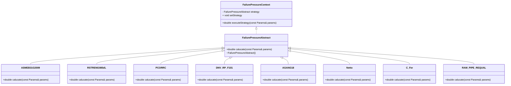

想写一个计算缺陷管道失效压力的程序，输入管道尺寸及裂纹参数能够使用不能的方法计算出失效压力，然后输出到csv文件中。




## 1、失效模型

根据需求选定策略模型来编写失效模型，方便代码维护。

首先定义一个抽象类，具有`calucate`函数，其他子类都要重写这个函数，实现不同的功能。

```c++
class FailurePressureAbstract {
public:
    virtual double calucate(const Params& params) = 0;
    virtual ~FailurePressureAbstract() = default; // 虚析构函数
};
```

其中`Params`类型是一个列表，可存储`float`、`double`和`int`三种类型，定义如下

```c++
using Params = std::vector<std::variant<float, double, int>>;
```

子类集成父类，定义如下

```c++
class ASMEB31G2009 : public FailurePressureAbstract {
public:
    double calucate(const Params& params) override;
};

class RSTRENG085dL : public FailurePressureAbstract {
public:
    double calucate(const Params& params) override;
};

class PCORRC : public FailurePressureAbstract {
public:
    double calucate(const Params& params) override;
};

class DNV_RP_F101 : public FailurePressureAbstract {
public:
    double calucate(const Params& params) override;
};

class C_Fer : public FailurePressureAbstract {
public:
    double calucate(const Params& params) override;
};

class AGANG18 : public FailurePressureAbstract {
public:
    double calucate(const Params& params) override;
};

class Netto : public FailurePressureAbstract {
public:
    double calucate(const Params& params) override;
};

class RAM_PIPE_REQUAL : public FailurePressureAbstract {
public:
    double calucate(const Params& params) override;
};
```

子类实现如下

```c++

double ASMEB31G2009::calucate(const Params& params) {
    double t = std::get<double>(params[0]);
    double D = std::get<double>(params[1]);
    double d = std::get<double>(params[2]);
    double l = std::get<double>(params[3]);
    double SMYS = std::get<double>(params[4]);

    double S_flow = SMYS * 1.1;
    double z = pow(l, 2) / (D * t);

    double M = 0.0;
    if (z > 50) {
        M = 0.032 * z + 3.3;
    }
    else {
        M = pow(1 + 0.6275 * z - 0.003375 * pow(z, 2), 0.5);
    }

    double failure_pressure = S_flow * 2 * t / D * (1 - 0.85 * d / t) / (1 - 0.85 * d / t / M);
    std::cout << "调用 ASMEB31G2009 成功" << failure_pressure << std::endl;
    return failure_pressure;
};

double RSTRENG085dL::calucate(const Params& params) {
    double t = std::get<double>(params[0]);
    double D = std::get<double>(params[1]);
    double d = std::get<double>(params[2]);
    double l = std::get<double>(params[3]);
    double SMYS = std::get<double>(params[4]);

    double S_flow = SMYS + 68.95;
    double z = pow(l, 2) / (D * t);

    double M = 0.0;
    if (z > 50) {
        M = 0.032 * z + 3.3;
    }
    else {
        M = pow(1 + 0.6275 * z - 0.003375 * pow(z, 2), 0.5);
    }

    double failure_pressure = S_flow * 2 * t / D * (1 - 0.85 * d / t) / (1 - 0.85 * d / t / M);
    std::cout << "调用 RSTRENG085dL 成功" << failure_pressure << std::endl;
    return failure_pressure;
}

double PCORRC::calucate(const Params& params) {
    double t = std::get<double>(params[0]);
    double D = std::get<double>(params[1]);
    double d = std::get<double>(params[2]);
    double l = std::get<double>(params[3]);
    double UTS = std::get<double>(params[4]);

    double M = 1 - exp((-0.157 * l) / (pow(D / 2, 0.5) * (t - d)));

    double failure_pressure = 2 * t * UTS / D * (1 - d * M / t);
    cout << "调用 PCORRC 成功" << failure_pressure << endl;
    return failure_pressure;
}

double DNV_RP_F101::calucate(const Params& params)
{
    double t = std::get<double>(params[0]);
    double D = std::get<double>(params[1]);
    double d = std::get<double>(params[2]);
    double l = std::get<double>(params[3]);
    double UTS = std::get<double>(params[4]);

    double M = pow(1 + 0.31 * pow(l, 2) / (D * t), 0.5);

    double failure_pressure = 2 * t * UTS / (D - t) * ((1 - d / t) / (1 - d / t / M));
    cout << "调用 DNV_RP_F101 成功" << failure_pressure << endl;
    return failure_pressure;
}

double C_Fer::calucate(const Params& params)
{
    double t = std::get<double>(params[0]);
    double D = std::get<double>(params[1]);
    double d = std::get<double>(params[2]);
    double l = std::get<double>(params[3]);
    double SMYS = std::get<double>(params[4]);

    double z = pow(l, 2) / (D * t);
    double S_flow = SMYS * 0.9;

    double M = 0.0;
    if (z > 50) {
        M = 0.032 * z + 3.3;
    }
    else {
        M = pow(1 + 0.6275 * z - 0.003375 * pow(z, 2), 0.5);
    }

    double A0 = l * t;
    double A = l * d;

    double failure_pressure = 2 * t * S_flow / D * (1 - A/A0) / (1- A / A0 / M);
    cout << "调用 C_Fer 成功" << failure_pressure << endl;
    return failure_pressure;
}

double AGANG18::calucate(const Params& params)
{
    double t = std::get<double>(params[0]);
    double D = std::get<double>(params[1]);
    double d = std::get<double>(params[2]);
    double l = std::get<double>(params[3]);
    double SMYS = std::get<double>(params[4]);

    return 0.0;
}

double Netto::calucate(const Params& params)
{
    double t = std::get<double>(params[0]);
    double D = std::get<double>(params[1]);
    double d = std::get<double>(params[2]);
    double l = std::get<double>(params[3]);
    double SMYS = std::get<double>(params[4]);

    double failure_pressure = 1.1 * SMYS * 2 * t / D * (1 - 0.9435 * pow(d / t, 1.6) * pow(l / D, 0.4));
    cout << "调用 Netto 成功" << failure_pressure << endl;
    return failure_pressure;
}

double RAM_PIPE_REQUAL::calucate(const Params& params)
{
    double t = std::get<double>(params[0]);
    double D = std::get<double>(params[1]);
    double d = std::get<double>(params[2]);
    double l = std::get<double>(params[3]);
    double UTS = std::get<double>(params[4]);

    double SCF = 1 + 2 * pow(2 * d / D, 0.5);
    double failure_pressure = 2.2 * (t - d) * UTS / (D - t) / SCF;
    cout << "调用 RAM_PIPE_REQUAL 成功" << failure_pressure << endl;
    return failure_pressure;
}
```

## 2、定义上下文类

使用智能指针管理生命周期，并保证子类的所有权

```c++
// 上下文类
class FailurePressureContext {
private:
    std::unique_ptr<FailurePressureAbstract> strategy; // 使用unique_ptr来管理策略的生命周期
public:
    explicit FailurePressureContext(std::unique_ptr<FailurePressureAbstract> newStrategy)
        : strategy(move(newStrategy)) {
    }

    void setStrategy(std::unique_ptr<FailurePressureAbstract> newStrategy);

    double executeStrategy(const Params& params);
};

// 上下文类
void FailurePressureContext::setStrategy(std::unique_ptr<FailurePressureAbstract> newStrategy) {
    strategy = move(newStrategy);
}

double FailurePressureContext::executeStrategy(const Params& params) {
    if (strategy) {
        return strategy.get()->calucate(params);
    }
}
```

## 3、输出文件类定义

主要有打开、关闭文件，写入行函数，写入行函数使用模板实现传入不同类型的值。

> 这里一开始写的`写入头`函数只能写入字符串，在调用时需要将其他类型转化一下，不太方便，于是还按照`写入行`函数进行调用。

```c++
// .h文件
class CSVFileWriter {
private:
    std::ofstream file;    // 文件输出流

public:
    // 构造函数，接受文件名
    CSVFileWriter(const std::string& filename);

    // 析构函数，确保关闭文件
    ~CSVFileWriter();

    // 写入标题行
    template<typename T>
    void writeHeader(const std::vector<T>& headers);
    //void writeHeader(const std::vector<std::string>& headers);

    // 写入一行数据
    template<typename T>
    void writeRow(const std::vector<T>& row); // 声明模板函数，但实现放在头文件中

    // 检查文件是否打开
    bool isOpen() const;
};

// 模板函数实现
template<typename T>
void  CSVFileWriter::writeRow(const std::vector<T>& row) {
    for (size_t i = 0; i < row.size(); ++i) {
        // 提取变体的值并写入
        std::visit([this, i, size = row.size()](const auto& arg) {
            file << arg << (i < size - 1 ? "," : "");
            }, row[i]);
    }
    file << "\n"; // 换行
}

// 写入标题行
template<typename T>
void CSVFileWriter::writeHeader(const std::vector<T>& headers) {
    writeRow(headers);
}

// .cpp文件
// 构造函数
CSVFileWriter::CSVFileWriter(const std::string& filename) {
    file.open(filename);
    if (!file.is_open()) {
        throw std::runtime_error("无法打开文件: " + filename);
    }
}

// 析构函数
CSVFileWriter::~CSVFileWriter() {
    if (file.is_open()) {
        file.close();
    }
}

// 检查文件是否打开
bool CSVFileWriter::isOpen() const {
    return file.is_open();
}
```

## 4、示例调用

这里有详细的注释就不写了。

```c++
// main.cpp
// 输出文件名称
std::string name = "X52";
// 基于屈服极限的参数列表
Params X52_SMYS = { 6.3, 462.6, 6.0, 200.0, 435.5 };
// 基于强度极限的参数列表
Params X52_UTS = { 6.3, 462.6, 6.0, 200.0, 530.0 };

// 定义行类型
using RowParams = std::vector<std::variant<double, std::string>>;
RowParams ASMEB31G2009_res_list = { "ASMEB31G2009" };
RowParams RSTRENG085dL_res_list = { "RSTRENG085dL" };
RowParams PCORRC_res_list = { "PCORRC" };
RowParams DNV_RP_F101_res_list = { "DNV_RP_F101" };
RowParams C_Fer_res_list = { "C_Fer" };
RowParams Netto_res_list = { "Netto" };
RowParams RAM_PIPE_REQUAL_res_list = { "RAM_PIPE_REQUAL" };

// 定义多行数据，存储指针
std::vector<RowParams*> rows;
rows.push_back(&ASMEB31G2009_res_list );
rows.push_back(&RSTRENG085dL_res_list );
rows.push_back(&PCORRC_res_list );
rows.push_back(&DNV_RP_F101_res_list);
rows.push_back(&C_Fer_res_list );
rows.push_back(&Netto_res_list );
rows.push_back(&RAM_PIPE_REQUAL_res_list );
```

调用上下文类计算

```c++
// main.cpp
// 定义缺陷深度的变化范围
std::vector<double> t = { 1, 2, 3, 4, 5, 6 };
for (size_t i = 0; i < t.size(); i++)
{
    X52_SMYS[2] = t[i];
    X52_UTS[2] = t[i];

    // 创建上下文，初始采用FIFO策略
    FailurePressureContext context(make_unique<ASMEB31G2009>());
    ASMEB31G2009_res_list.push_back( context.executeStrategy(X52_SMYS)  );

    context.setStrategy(make_unique<RSTRENG085dL>());
    RSTRENG085dL_res_list.push_back(context.executeStrategy(X52_SMYS));

    context.setStrategy(make_unique<PCORRC>());
    PCORRC_res_list.push_back(context.executeStrategy(X52_UTS) );

    context.setStrategy(make_unique<DNV_RP_F101>());
    DNV_RP_F101_res_list.push_back(context.executeStrategy(X52_UTS) );

    context.setStrategy(make_unique<C_Fer>());
    C_Fer_res_list.push_back(context.executeStrategy(X52_SMYS) );

    context.setStrategy(make_unique<Netto>());
    Netto_res_list.push_back(context.executeStrategy(X52_SMYS) );

    context.setStrategy(make_unique<RAM_PIPE_REQUAL>());
    RAM_PIPE_REQUAL_res_list.push_back(context.executeStrategy(X52_UTS));
}
```

写入文件

```c++
// 写入文件
try {
    // 创建 CSVFileWriter 对象
    CSVFileWriter csvWriter(name + ".csv");
    RowParams header = { "method"};
    header.insert(header.end(), t.begin(), t.end());
    // 写入表头
    csvWriter.writeHeader(header);

    // 写入多行数据
    for (const auto& entry : rows)
    {
        csvWriter.writeRow(*entry);
    }

    std::cout << "数据已成功写入 " << name << ".csv" << std::endl;
    std::cout << "大功告成 " << name << ".csv" << std::endl;
}
catch (const std::exception& e) {
    std::cerr << "错误: " << e.what() << std::endl;
    return 1; // 返回错误代码
}
```

输出文件示例

<div style="width: 80%; margin: auto">
 
</div>